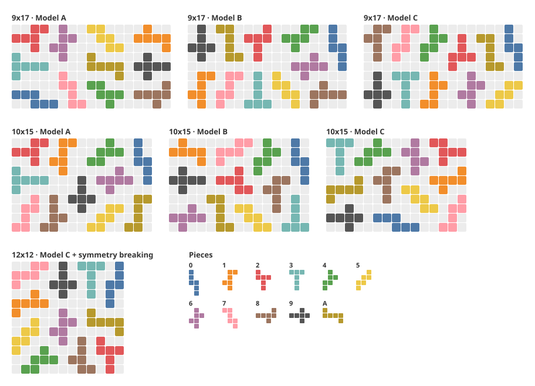

# Untouchable 11 — SAT / CNF Encoding

> 大學部專題研究成果（大三上學期）
> 作者：吳展宇

本 repository 整理我在大三上學期的專題：將 **Untouchable 11** 拼圖的放置問題轉換為 SAT 問題（DIMACS CNF），並嘗試三種不同的 CNF encoding（Model A / B / C），觀察 encoding 方式對 SAT solver 求解效率的影響。

這是一份課程專題的成果整理，不是正式發表的論文；實驗規模與記錄方式都有其限制，詳見 [Reproducibility and Notes](#reproducibility-and-notes)。大三下學期的延伸專題見 [new_puzzle_2026](https://github.com/Michaelwu128/new_puzzle_2026)。

**Abstract.** This repository contains my undergraduate research project (junior year, fall semester) on the *Untouchable 11* puzzle: placing 11 distinct cube-net pieces on a 9x17, 10x15, or 12x12 board so that no two pieces touch, not even at a corner. I encode the placement problem as SAT (DIMACS CNF) and compare three encodings: a placement-only encoding (Model A), a hybrid encoding with cell variables and channeling clauses (Model B), and Model B with a sequential-counter at-most-one constraint (Model C). On the 9x17 board, the number of clauses drops from about 7.2 million (A) to 1.9 million (B) and 123 thousand (C), and the CaDiCaL solving time drops from 7 to 3 to 1 minute. The 12x12 board was solved only with Model C plus a simple symmetry-breaking constraint (208 minutes); Models A and B found no solution within 24 hours.

---

## Highlights

- **SAT 建模**：把「11 塊不同拼圖放進盤面、任兩塊不能接觸」的問題寫成 DIMACS CNF。以 Python 產生所有合法放置與子句，交給 SAT solver（主要為 CaDiCaL，部分使用 MiniSat）求解，再把輸出轉回盤面。
- **逐步改善 encoding（Model A → B → C）**：Model A 只用 placement 變數；Model B 加入格子變數，把衝突限制移到「格子層」；Model C 再以 Sequential Counter 取代 pairwise 的 at-most-one。9x17 的子句數由約 720 萬降到約 12 萬。
- **三種盤面都找到解**：9x17、10x15、12x12。最難的 12x12 只有在 Model C 加上對稱性破除時才解出（208 分鐘），Model A、B 超過 24 小時仍無解。
- **結果可檢查**：repo 附 7 組解答與驗證腳本，可以重新確認每組解都符合規則；專題當時的 9 支 generate 腳本重新執行後，產生的 CNF 與當初相同。



上圖為 repo 中 7 組解答的盤面，同一塊拼圖在各盤面使用相同顏色（由 [`docs/render_solutions.py`](docs/render_solutions.py) 讀取解答檔產生）。

## Problem Description

- 共有 **11 塊不同的拼圖**，每一塊都是一個正方體的平面展開圖（6 格）。
- 盤面有 3 種大小，依難度排序為 **9x17、10x15、12x12**。
- 目標是把 **所有拼圖** 放進盤面。
- 每塊拼圖可以 **旋轉、翻面**。
- **任兩塊拼圖不能有任何接觸，不論是邊還是角**（即不同拼圖的格子在 8 鄰域內不能相鄰）。

11 塊拼圖的形狀定義在每支 generate 腳本的 `pieces_raw` 中，圖示見 [`docs/solution_grids.md`](docs/solution_grids.md#拼圖編號)。

## SAT / CNF Formulation

### 符號

| 符號 | 意義 | 9x17 的值 |
|---|---|---|
| P | 拼圖數量 | 11 |
| M | 盤面格子數 | 153 |
| D | 一個格子的鄰居數 | 8 |
| N | 所有拼圖的合法放置總數 | 6008 |
| k | 平均每塊拼圖的放置數（N / P） | 約 546 |

### 放置變數（三個模型共用）

程式先對每塊拼圖產生所有旋轉 / 翻面後不重複的形狀，再枚舉所有完全落在盤面內的位置。每一個「(拼圖 p, 形狀 o, 左上角位置 x, y)」對應一個布林變數 **v(p,o,x,y)**，為真表示採用這個放置。

變數編號與放置方式的對應寫在 `placements*.txt`（格式：`var,piece,transform,x,y,cells`），show 腳本就是用這個檔案把 solver 的輸出轉回盤面。

### 三類限制

1. **每塊拼圖至少放一次**：對每塊拼圖，把它的所有放置變數 OR 起來。
2. **每塊拼圖至多放一次**（at-most-one）。
3. **不重疊、不接觸**：不同拼圖的格子不能重疊，也不能在 8 鄰域內相鄰。

三個模型的差別在於第 2、3 類限制的寫法。

## Model A / Model B / Model C

### Model A — Placement-level encoding

- 變數：只有 v(p,o,x,y)。
- 至多一次：同一塊拼圖的放置兩兩配對 `(¬vi ∨ ¬vj)`，子句數 O(P·k²) = O(N²/P)。
- 不重疊 / 不接觸：對不同拼圖的每一對放置，若兩者佔用的格子重疊或在 3x3 範圍內相鄰，就加入 `(¬va ∨ ¬vb)`，子句數 O(N²)。
- 子句數量級約為 O(N²)，9x17 約 10⁷。

程式：`experiments/*/model_A/generate_*_modelA.py`（12x12 版本為整理 repo 時補上，見 [限制](#限制)）

### Model B — Hybrid encoding（加入格子變數）

- 新增格子變數 **c(r,c,p)**：格子 (r,c) 被拼圖 p 佔據。9x17 共 153 × 11 = 1683 個。
- 通道子句（channeling）：
  - **v ⇒ c**：若選了某個放置，它佔的每一格都要標記為該拼圖，`(¬v ∨ c(r,c,p))`，O(N)。
  - **c ⇒ v**：若格子被拼圖 p 佔據，則必有某個能蓋到這格的 p 放置被選中，`(¬c(r,c,p) ∨ v1 ∨ v2 ∨ …)`，O(M·P)。
- 不重疊：每個格子上，不同拼圖的 c 變數兩兩互斥，O(M·P²)。
- 不接觸：每個格子只檢查 4 個方向的鄰居（右、左下、下、右下），避免重複，對不同拼圖 pA ≠ pB 加入 `(¬c(r,c,pA) ∨ ¬c(nr,nc,pB))`，O(M·(D/2)·P²)。
- 至多一次仍是 pairwise，因此整體量級變成 O(N²/P)，9x17 約 10⁶。

程式：`experiments/*/model_B/generate_*_modelB.py`

### Model C — Hybrid encoding + Sequential Counter

- 除了「至多一次」之外，其餘子句與 Model B 相同。
- 「至多一次」改用 Sequential Counter Encoding（見下一節），每塊拼圖只需 O(k) 個子句，總共 O(N)。
- 整體量級變成 O(M·(D/2)·P²)，9x17 約 10⁵。

程式：`experiments/*/model_C/generate_*_modelC.py`

### 12x12：Model C + Symmetry Breaking

實際解出 12x12 的版本（`experiments/12x12/model_C_symmetry/generate_12x12_modelC_symmetry.py`）在 Model C 之外多加了一個對稱性破除：**強制拼圖 0 的放置位置 x ≤ ⌊12/2⌋ = 6**，也就是只保留上半部的放置（不產生其他放置的變數）。

12x12 盤面上下翻轉後仍是同一個盤面，而程式產生的形狀集合包含所有旋轉與翻面。因此任何「拼圖 0 在下半部」的解，上下翻轉後都會對應到一個 x ≤ 6 的解，這個限制不會讓原本有解的問題變成無解。[求解時間](#求解時間)表中 12x12 的 Model C（208 min）就是這個版本的結果。

### 實際 CNF 規模

下表數字取自各 generate 腳本產生的 CNF 檔 header（`p cnf <變數數> <子句數>`）：

| 盤面 | 模型 | 放置數 N | 變數數 | 子句數 |
|---|---|---:|---:|---:|
| 9x17 | A | 6008 | 6,008 | 7,221,543 |
| 9x17 | B | 6008 | 7,691 | 1,937,025 |
| 9x17 | C | 6008 | 13,688 | 123,097 |
| 10x15 | A | 5976 | 5,976 | 7,312,247 |
| 10x15 | B | 5976 | 7,626 | 1,916,177 |
| 10x15 | C | 5976 | 13,591 | 121,621 |
| 12x12 | A ※ | 5752 | 5,752 | 7,020,687 |
| 12x12 | B | 5752 | 7,336 | 1,778,763 |
| 12x12 | C | 5752 | 13,077 | 116,899 |
| 12x12 | C + symmetry breaking | 5666 | 12,905 | 116,125 |

※ 12x12 Model A 的數字來自整理 repo 時補上的腳本。

以 9x17 為例，子句數由 A → B → C 大約各少一個數量級，與前面的量級分析（約 10⁷、10⁶、10⁵）一致。Model C 的變數數較多，是因為 Sequential Counter 為每塊拼圖多加了 k − 1 個輔助變數。

## Sequential Counter Encoding

對同一塊拼圖的放置變數 v₁, v₂, …, vₖ，引入 k − 1 個輔助變數 s₁, …, sₖ₋₁（sᵢ 可理解為「前 i 個變數中已經有一個為真」），程式中加入的子句為：

```text
(¬v1 ∨ s1)
(¬vk ∨ ¬s(k-1))
對 i = 2 … k-1：
    (¬vi ∨ si)          若 vi 為真，則 si 為真
    (¬s(i-1) ∨ si)      計數一旦為真就一路傳下去
    (¬vi ∨ ¬s(i-1))     前面已經有一個為真時，vi 不能再為真
```

每塊拼圖共 3k − 4 個子句、k − 1 個輔助變數，取代原本 pairwise 的 k(k−1)/2 個子句。11 塊拼圖合計新增 (N − 11) 個輔助變數，子句數從 O(N²/P) 降為 O(N)。

實作見 `generate_*_modelC.py` 中「規則 1」的部分。（期末報告投影片中第三組子句誤寫為 `(-v2+s1)…`，正確應為 `(¬vᵢ ∨ ¬sᵢ₋₁)`，以程式實作為準。）

這個 encoding 一般稱為 Sequential Counter，參考：C. Sinz, *Towards an Optimal CNF Encoding of Boolean Cardinality Constraints*, CP 2005。

## How to Run

### 環境

- Python 3（只用到標準函式庫；整理 repo 時以 Python 3.13 測試）
- SAT solver：[CaDiCaL](https://github.com/arminbiere/cadical)（專題主要使用）或 MiniSat

### 1. 直接檢視 repo 中已有的解答

每個實驗資料夾都附有 solver 解答與對照表，不需要安裝 solver：

```bash
cd experiments/12x12/model_C_symmetry
python show_12x12_modelC_symmetry.py             # 彩色輸出（ANSI）
python show_12x12_modelC_symmetry.py --no-color  # 純文字
```

其他資料夾用法相同，執行該資料夾內的 `show_*.py` 即可。

### 2. 重新產生 CNF

```bash
cd experiments/9x17/model_C
python generate_9x17_modelC.py
```

會在目前資料夾輸出 CNF 檔（例如 `untouchable_9x17_hybrid_amo.cnf`）和 `placements*.txt`。

- CNF 檔不放進 repo（由 `.gitignore` 排除），需要時自行產生；`examples/` 中附了一個 9x17 Model C 的 CNF 作為範例。
- 整理 repo 時已重新執行專題當時的 9 支 generate 腳本，產生的 CNF 與 placements 檔與當初的檔案內容相同（只有換行符號 LF / CRLF 的差異）。
- Model A 的 CNF 約 100 MB（超過 700 萬個子句），產生約需 1–2 分鐘；Model B / C 只需幾秒。

### 3. 用 SAT solver 求解

```bash
cadical untouchable_9x17_hybrid_amo.cnf > my_solution.txt
```

注意事項：

- **請用 `>` 把 CaDiCaL 的標準輸出存成檔案。** `cadical input.cnf output.txt` 這種寫法會把第二個參數當成 **DRAT 證明檔** 的輸出路徑（難解的例子可能達數十 GB），而不是解答。generate 腳本最後印出的提示用的正是這種寫法，請不要照做。
- MiniSat 的用法是 `minisat input.cnf output.txt`，輸出為 `SAT` 加上一行變數賦值（9x17 Model A 的解答即為此格式）。
- 要檢視自己的求解結果，請修改對應 show 腳本開頭的 `SOLUTION_FILE`。
- 10x15 / 12x12 的 show 腳本只讀取 `v ` 開頭的行，可以直接讀 CaDiCaL 的完整輸出。
- 9x17 的 show 腳本會把檔案中所有整數都當成變數，只適用於 MiniSat 格式或只含 `v` 行的檔案；若直接讀 CaDiCaL 的完整輸出，`c` 開頭統計行中的數字會被誤判。repo 中的解答檔都只保留了 `v` 行。

## Repository Structure

```text
untouchable11-sat/
├── README.md
├── .gitignore
├── experiments/                     # 依「盤面 / 模型」分組，每個資料夾可獨立執行
│   ├── 9x17/
│   │   ├── model_A/                 # generate + show + 解答 + placements 對照表
│   │   ├── model_B/
│   │   └── model_C/
│   ├── 10x15/
│   │   ├── model_A/
│   │   ├── model_B/
│   │   └── model_C/
│   └── 12x12/
│       ├── model_A/                 # 只有 generate（整理 repo 時補上，未在時限內解出）
│       ├── model_B/                 # 只有 generate（未在時限內解出）
│       ├── model_C/                 # 只有 generate（未加對稱性破除的版本）
│       └── model_C_symmetry/        # 實際解出 12x12 的版本
├── examples/
│   └── untouchable_9x17_hybrid_amo.cnf   # 範例 CNF（9x17, Model C, 約 1.9 MB）
├── docs/
│   ├── solutions.svg                # 7 組解答的彩色總覽圖
│   ├── render_solutions.py          # 驗證解答並產生 solutions.svg
│   └── solution_grids.md            # 7 組解答的文字盤面（標示拼圖編號）
├── slides/
│   ├── untouchable_11_final_report.pdf   # 期末報告投影片
│   └── untouchable_11_final_report.pptx
└── legacy/
    └── show917.py                   # 早期版本的 show 腳本（盤面顯示數字），保留作紀錄
```

每個實驗資料夾的檔案命名：

| 檔案 | 說明 |
|---|---|
| `generate_<盤面>_model<X>.py` | 產生 CNF 與 placements 對照表 |
| `show_<盤面>_model<X>.py` | 讀取解答與對照表，在終端機畫出盤面 |
| `solution_<盤面>_model<X>.txt` | 專題當時 SAT solver 的解答 |
| `placements*.txt` | 變數編號 ↔ 拼圖放置方式的對照表（檔名沿用 generate 腳本的輸出名稱） |

`legacy/show917.py` 讀取的 `solution2.txt` 已不存在，僅保留作為開發紀錄。

## Experimental Results

### 求解時間

| 模型 | 9x17 | 10x15 | 12x12 |
|---|---|---|---|
| Model A | 7 min（MiniSat：24 min） | 306 min | 解不出來 |
| Model B | 3 min（MiniSat：14 min） | 4 min | 解不出來 |
| Model C | 1 min | 25 min | 208 min ※ |

- 除括號內標示 MiniSat 的數字外，皆使用 CaDiCaL。實測時 MiniSat 的速度比 CaDiCaL 慢。
- 「解不出來」：執行超過 24 小時仍沒有找到任何解。
- ※ 12x12 的 Model C 為加了對稱性破除的版本（見 [12x12：Model C + Symmetry Breaking](#12x12model-c--symmetry-breaking)）。

### 觀察

- 9x17：隨著模型改進，求解時間由 7 min → 3 min → 1 min 逐步縮短。
- 12x12：只有 Model C 解出；Model A、B 都超過 24 小時仍無解。
- 10x15：Model C（25 min）反而比 Model B（4 min）慢。我推測這可能是 SAT solver 用 Model C 求解時「運氣」較差，但沒有進一步驗證。
- 三種盤面都不只一個解，因此不同模型可能得到不同的放置方式。7 組解答的盤面見 [`docs/solution_grids.md`](docs/solution_grids.md)。

## Reproducibility and Notes

### 可驗證的部分

- repo 中 7 組解答（9x17 A/B/C、10x15 A/B/C、12x12 C + symmetry breaking）都可以用對應的 show 腳本還原成盤面。
- 每組解答都恰好放入 11 塊不同的拼圖（共 66 格），且任兩塊拼圖之間沒有邊或角的接觸。執行 `python docs/render_solutions.py` 會重新檢查這些條件並產生總覽圖，任一組不符合就會報錯。
- 整理 repo 時以 CaDiCaL 2.1.3 重新求解 `examples/untouchable_9x17_hybrid_amo.cnf`（9x17 Model C），約 14 秒得到與 repo 中相同的解。硬體與 solver 版本和專題當時不同，這個時間不能直接和上表比較。

### 限制

- 求解時間是專題期間的單次實測，當時沒有保留 solver log、硬體規格與 solver 版本，因此無法精確重現這些時間。
- 沒有進行多次重複實驗或改變亂數種子，10x15 中 B、C 的時間差異無法判斷是 encoding 造成還是隨機性。
- 12x12 未加對稱性破除的 Model C（`experiments/12x12/model_C/`）沒有留下求解結果。
- 12x12 Model A 當時的腳本與 CNF 沒有保留下來。repo 中的 `experiments/12x12/model_A/generate_12x12_modelA.py` 是整理 repo 時由 10x15 版本補上的，只修改盤面大小；整理時沒有重新求解。
- 期末報告投影片中 Sequential Counter 的第三組子句寫錯，以程式實作為準（見 [Sequential Counter Encoding](#sequential-counter-encoding)）。

## Future Work

- **改用頂點的映射模型**：G4G13 的一篇文章（Carl Hoff, [From Untouchable 11 to Hazmat Cargo](https://www.gathering4gardner.org/g4g13gift/puzzles/HoffCarl-GiftExchange-FromUntouchable11toHazmatCargo-G4G13.pdf)）提出，可以只看每塊拼圖周圍的頂點，把 12x12 的格子盤面改成 13x13 的點，規則從「拼圖不能接觸」變成「任兩塊拼圖的頂點不能重合」。依該文所述，作者用原本的方法花了 24 天才找到 12x12 的全部 7 個解，改用映射後不到 1 小時就全部找到。之後可以嘗試把這個映射寫成 SAT encoding，與本專題的模型比較。
- **列舉所有解**：每解出一個解後，加入一個排除該解的子句再重新求解，直到 UNSAT，就能找出所有解。

## Follow-up Project

大三下我延續這個專題，以自己設計的 12×12 拼圖研究 dead-pocket 剪枝與 learning-guided pruning：[new_puzzle_2026](https://github.com/Michaelwu128/new_puzzle_2026)。
